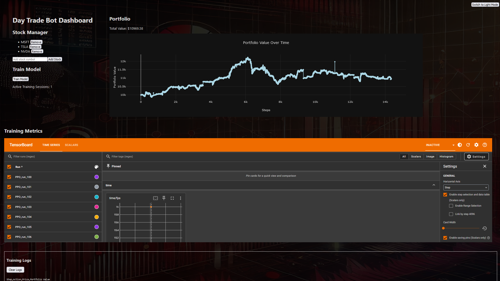

# Day-Trade-Bot# Day-Trade-Bot

## Overview
Day-Trade-Bot is an AI-driven stock trading bot designed for day trading in financial markets. Leveraging advanced machine learning algorithms and technical indicators, the bot automates decision-making for buying, selling, or holding stocks. Initially focused on paper trading for testing and optimization, the bot is designed to integrate with real-time broker APIs for live trading.

## Screenshots
### Dashboard View

---

## Features
- **Technical Indicators**: Computes and utilizes EMA (8, 21, 50), RSI, MACD, VWAP, and candlestick patterns (Doji, Hammer, Engulfing) for trading decisions.
- **AI Model**: Trained using Proximal Policy Optimization (PPO) for reinforcement learning.
- **Paper Trading**: Simulates trading using historical data for testing and optimization.
- **TensorBoard Integration**: Provides visual insights into training performance, including rewards and losses.
- **Web Interface**:
  - View portfolio performance.
  - Add or remove stocks from the trading list.
  - Start and monitor model training.
- **Customizable**: Fully customizable indicators, reward functions, and trading logic.


---

## Setup

### Prerequisites
1. **Python Environment**:
   - Python 3.8 or higher.
   - Install required libraries:
     ```bash
     pip install -r requirements.txt
     ```
2. **Node.js and NPM**:
   - Install the latest version of Node.js for the Web UI.

3. **API Key for Stock Data**:
   - Obtain an API key from [Alpha Vantage](https://www.alphavantage.co/support/#api-key) or another provider.

4. **Broker API** (for future live trading):
   - Obtain credentials from your preferred broker (e.g., Alpaca, Interactive Brokers).

### Environment Variables
Create a `.env` file in the `application` directory with the following keys:


ALPHA_VANTAGE_API_KEY=your_api_key_here


---

## Usage

### Backend and Web Setup
Start the Flask backend server:
```
python web/backend/app.py
```
Start the React frontend:
```
cd web/frontend
npm start
```
Step 1: Fetch Stock Data

Run data_fetch.py to download intraday data and compute indicators:

```
python application/scripts/data_fetch.py
```
Step 2: Prepare Data
Clean and prepare the fetched data for training:

```
python application/scripts/data_preparation.py
```
Step 3: Train and Test the Model
Train the PPO model and simulate trading:
```
python application/test_ppo.py
```
Step 4: Monitor Training with TensorBoard
Start the TensorBoard server:
```
tensorboard --logdir=ppo_tensorboard/
```
Open http://localhost:6006 in your browser to view training metrics.

Step 5: Use the Web Interface
Access the Web UI at http://localhost:3000:
Add/remove stocks to/from the trading list.
View portfolio performance.
Trigger model training.
View TensorBoard logs via the integrated link.


## Planned Features
-Real-Time Integration: Connect to broker APIs for live trading execution.
-Strategy Refinement: Incorporate additional indicators and AI models.
-Performance Metrics: Detailed metrics and backtesting results.
-Advanced Visualization: Integrate more interactive graphs using libraries like Plotly.

## Contributions
Contributions are welcome! Fork the repository, create a feature branch, and submit a pull request.

## License
This project is licensed under the MIT License. See the LICENSE file for details.

